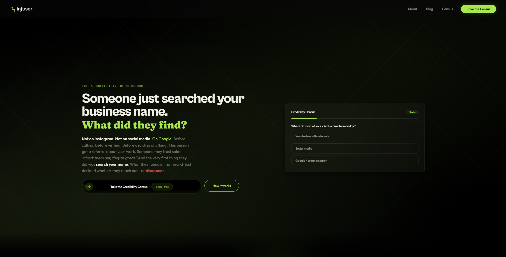
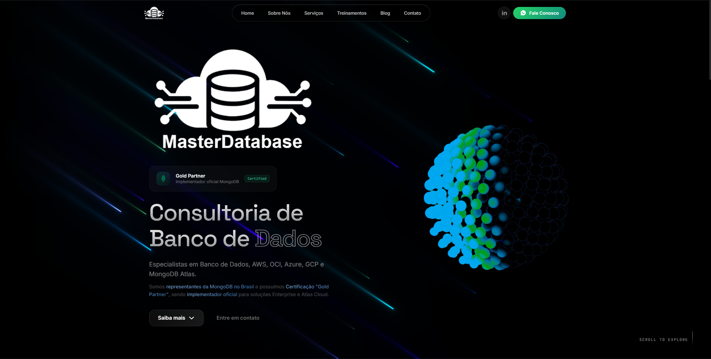

<div align="center">


<a href="https://infuserinter.com">

</a>

<br/><br/>

```
digital credibility infrastructure
```

# I build websites that earn trust at first search.

**Founder of [Infuser](https://infuserinter.com)** - I design and develop conversion-focused websites<br/>for local businesses that are already good at what they do<br/>but don't prove it digitally.

<br/>


</div>

<br/>

## What I do

Most small businesses lose clients before they ever make contact. Someone gets a referral, searches the business name, finds a weak digital presence, and leaves. No call. No message. No signal.

I fix that. Every site I build starts with research: what do customers see when they search this business? Then I design the infrastructure that closes the gap between the quality of the work and what shows up online.

<br/>

## Featured work

<table>
<tr>
<td width="50%">

### 🔗 [Infuser](https://infuserinter.com)

<a href="https://infuserinter.com">

</a>

**My own platform.** Next.js site with narrative-driven copy, interactive revenue loss calculator, embedded Credibility Census tool, and scroll-triggered animations. The site practices what I preach.

`Next.js` `React` `Tailwind` `Framer Motion`

</td>
<td width="50%">

### 🔗 [MasterDatabase](https://masterdatabase.com.br)

<a href="https://masterdatabase.com.br">

</a>

**Database consulting firm** with 13+ years and clients like XP Inc, PicPay, and Energisa. Full redesign: animated 3D hero, tech stack marquee, conversion-focused service pages, mobile-first.

`HTML/CSS/JS` `Three.js` `Responsive` `SEO`

</td>
</tr>
</table>

<br/>

## Stack

<div align="center">

| Design | Frontend | Languages | Tools |
|:---:|:---:|:---:|:---:|
|  |  |  |  |
|  |  |  |  |
|  |  |  |  |
| |  |  |  |
| |  |  | |

</div>

<br/>

## Let's connect

<div align="center">

<a href="https://infuserinter.com">

</a>
<a href="https://www.linkedin.com/in/yan-botossi-galasso-931111328/">

</a>
<a href="mailto:hello@infuserinter.com">

</a>

<br/><br/>


</div>
